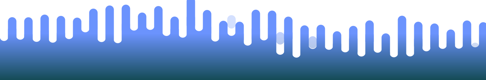

  

<h1 align='center'>Hi there 👋</h1>
- 💬 I am passionate about computer technology, which has driven me to pursue a career in programming
 
 

<b align='left'>Connect with me:</b>

  
  
    

<h2 align='left'>Languages and Tools:</h2>

  <!-- langs -->
<!--   <h3>Languages</h3> -->
  <!-- 

    
<b>💻 Hardware & Device</b>

    

    

  
 -->

  

    
<b>💻 Programming Languages</b>

    

      
      
      
      
      
      
    

  

  <!-- frameworks -->
  

    
<b>🧰 Frameworks</b>

    

      
      
      
      
      
      
      
      
    

  

   <!-- os -->
   

     
<b>💻 Operating Systems </b>

      

        
        
         
        
        
        
        
        
      

   

 

<h2 align='left'>on progress</h2>

|            |    |
| -------------------------------------------------------------------------------------------------------------------------------------------------------------------------------------------------------------------------------------------------- | -------------------------------------------------------------------------------------------------------------------------------------------------------------------------------------------------------------------------------------------------- |
|  |  |

<h2 align='left'>stats</h2>

  
   
  
   
  

